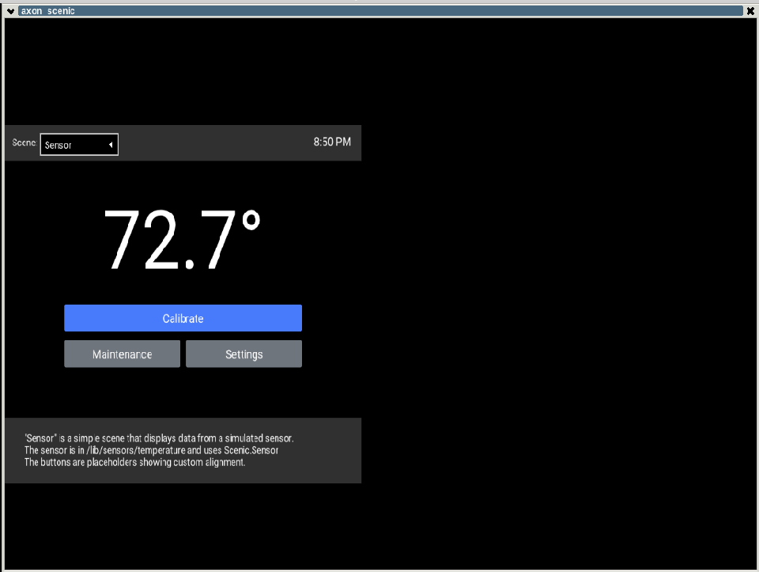

In this guide we are using a layer called [meta-axon](https://github.com/joaohf/meta-axon) to hold:

- the [axon](https://github.com/joaohf/meta-axon/blob/master/recipes-extended/axon/axon_git.bb) recipe application
- the [axon scenic](https://github.com/joaohf/meta-axon/blob/master/recipes-extended/axon/axon-scenic_git.bb) recipe application
- [axon-image-minimal](https://github.com/joaohf/meta-axon/blob/master/recipes-extended/image/axon-image-minimal.bb), a basic image to run axon application
- [axon-image-x11](https://github.com/joaohf/meta-axon/blob/master/recipes-graphics/images/axon-image-x11.bb), a basic image with x11 to run axon scenic demo application
- [axon-embedded-image-minimal](https://github.com/joaohf/meta-axon/blob/master/recipes-extended/image/axon-embedded-image-minimal.bb), a very basic image with axon application and erlang embedded init script package group, with [erlinit](https://github.com/nerves-project/erlinit) as replacement for '/sbin/init'

The idea is to show two examples about how to run erlang and elixir applications. However this layer is just to demonstration purposes.

In order to test the axon layer and build images, the first step is clone the layer repository:

```bash
git clone https://github.com/joaohf/meta-erlang.git
```

Then, go to the previous build environment directory and add meta-axon to 'conf/bblayers.conf':

```bash
bitbake-layers add-layer [path to clonned meta-axon directory]
```

Now its time to build the images and runqemu to check the results:

 * Emebedded erlang application:
```bash
bitbake axon-image-minimal
runqemu axon-image-minimal
```
 * Embedded elixir application with scenic:
```bash
bitbake axon-image-x11
runqemu axon-image-x11
```

The follow screenshot shows a qemu session running axon scenic application:




