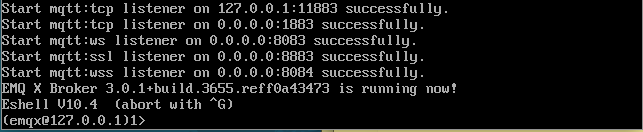
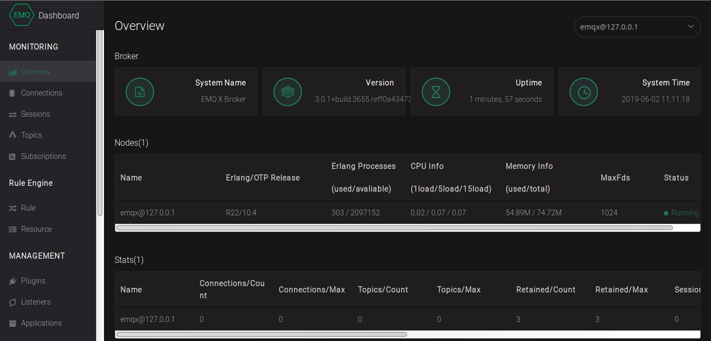

In this guide we are using the plain meta-erlang layer to build an [mqtt](http://mqtt.org/) broker called [EMQ](https://www.emqx.io/).

The recipe [emqx_git.bb](https://github.com/joaohf/meta-erlang/blob/master/recipes-connectivity/emqx/emqx_git.bb) builds the emqx using a crosscompile approach both to erlang and C. As emqx has a dependency called `bcrypt` which is a [NIF](http://erlang.org/doc/tutorial/nif.html) driver. To address the crosscompile, some [patches](https://github.com/joaohf/meta-erlang/blob/master/recipes-connectivity/emqx/files) were necessary.  

As a final result, we are able to run an embedded emqx using qemu.

Follow the quickstart guide to get a basic working environment and then:

 * Add erlang preferred version 22.x in _conf/local.conf_
```bash
echo 'PREFERRED_VERSION_erlang = "22%"
```
 * Add `emqx` package to `IMAGE_INSTAL` in _conf/local.conf_
```bash
echo 'IMAGE_INSTALL_append = " emqx"' >> conf/local.conf
```
 * Now its time to build the image:
```bash
bitbake core-image-minimal
```
 * And check the results with qemu:
```bash
runqemu core-image-minimal
```

The follow screenshot shows a qemu session running emqx application: ```/usr/lib/emqx/bin/emqx console```:



And the next screenshot shows the EMQ dashboard, when accessing it by http://192.168.7.2:18083:


